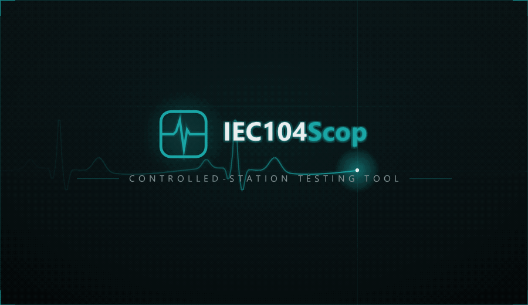

<p align="center">
  
</p>

**IEC104Scop Slave** is a free **IEC 60870-5-104 controlled-station (server)
simulator** with a modern, dockable **Dear ImGui** interface — part of the Scop
family alongside ModbusScop and DNPScop, sharing their look and feel. It emulates
**many IEC 104 stations at once** over **TCP** (port 2404), so engineers can test,
commission, and troubleshoot IEC 104 masters and SCADA systems without real field
hardware.

The complete IEC 104 stack — APCI framing with I / S / U frames and k / w flow
control, plus the ASDU / information-object codec — is **hand-rolled over Asio**,
with no third-party protocol library.

Free to use and redistribute under the permissive **BSD 2-Clause License**.

Developed by **Carlos Nardi**.

[](https://buymeacoffee.com/cnardi)

<p align="center">
  
</p>

## Concept

IEC104Scop Slave is organized as a tree: **Channels → RTUs → Points**.

- A **Channel** is one **TCP listener** (bind address and port) serving several
  masters at once, up to a configurable limit, with its own **APCI parameters**
  (k, w, t1, t2, t3). Each channel runs on its own I/O thread; start and stop them
  independently.
- An **RTU** is one simulated station with its own **common address (CA)** inside
  a channel. A channel can host many RTUs and routes every ASDU to the matching
  common address. Each RTU has its own **cyclic**, **background-scan**, and
  **double-transmission** settings.
- Each RTU carries a **point database** — **Indications** (single-point,
  double-point, step position), **Measurands** (normalized, scaled, float),
  **Counters** (integrated totals), and **Controls** (single, double, and
  regulating-step commands, setpoints) — editable directly in the UI, each point
  with its own quality, time tag, event type, simulation, and control permission.

## Features

- **Complete hand-rolled IEC 104 stack** over Asio (no third-party library):
  APCI **I / S / U** frames, per-master sequence numbers and **STARTDT** gating,
  **w-threshold acknowledgements**, **TESTFR** keep-alive, and the **k / w / t1 /
  t2 / t3** parameters, all configurable per channel.
- **Multi-station, multi-master simulation** — many channels, each with many
  stations on distinct common addresses; each TCP channel serves several masters
  concurrently (configurable maximum).
- **Full point model** — M_SP, M_DP, M_ST, M_ME_NA/NB/NC (normalized / scaled /
  float), and M_IT, each selectable per point as plain, **CP24Time2a**, or
  **CP56Time2a** time-tagged; the measurand type is switchable in place.
- **Interrogation, counters, and clock** — answers **General Interrogation
  (C_IC)** and **Counter Interrogation (C_CI)** with the station image and
  accepts **Clock Synchronization (C_CS)**, tracking the master's time offset.
- **Spontaneous, cyclic, and background transmission** — per-point
  **spontaneous** events (COT 3) on change, per-RTU **cyclic** transmission
  (COT 1) of flagged measurands, a periodic **background scan** (COT 2) of the
  whole database, and optional **double transmission** (plain type followed by
  the time-tagged twin).
- **Commands + glue logic** — executes Single (C_SC), Double (C_DC), Regulating
  Step (C_RC) and normalized / scaled / float Setpoints (C_SE_NA/NB/NC), plain or
  CP56 time-tagged, with **select / execute**. A per-point **Linked IOA** mirrors
  the command onto a monitor point, and the **Glue Logic** editor maps command
  triggers (any / ON / OFF / LOWER / RAISE, by qualifier) to actions — *Set to
  Value*, *Pulse*, *Increment*, *Decrement*, *Randomize*, *Set to Command Value* —
  on any point.
- **Fault injection** — per-point **control permission** (Allow, Deny selection,
  Deny execution, No control — refusals mirror the command with the NEGATIVE bit)
  and per-point **quality flags** (IV, NT, SB, BL, OV).
- **Per-point simulation** — **Sine**, **Ramp**, **Random**, **Increment**, and
  **Toggle**, constrained by each point's type and paced per point, with a global
  **Start Sim / Stop Sim** button and a 0.1× – 10× speed slider.
- **Editable point windows** — a Master-style grid per RTU with sorting, multi-
  select editing that propagates to every selected point, **engineering scaling**
  (Eng Min / Eng Max / units), and **CSV export / import** of the complete point
  definition (values, quality, time tag, simulation, permissions, links).
- **Animation** — rows flash when a master commands them, when simulation or
  spontaneous events change them, or when you edit them by hand — three
  configurable colors under **Setup → Animation**; the tree blinks on traffic.
- **Communication Monitor** — a timestamped, filterable log of every APDU per
  channel, master, and RTU, with a layered **APCI / ASDU decode** of the selected
  frame and optional **log-to-file** with size-based rotation.
- **Status Messages & Dashboard** — master connect/disconnect, command
  execution and refusal traces, clock-sync events, plus live per-channel Tx / Rx
  counters and uptime.
- **Workspaces** — save and reload your entire setup (`.i4sw`): channels
  (endpoint, master limit, APCI parameters, running state), stations, points with
  values, quality, event types, simulations, permissions, links, and glue rules.
  Channels that were running are started again on load.
- **Themes** — dark / light / classic with a customizable accent color, DPI
  scaling, and always-on-top; layout and preferences are remembered between runs.

## Download & run

1. Go to the [**Releases**](../../releases) page and download the latest
   `IEC104ScopSlave` archive for Windows.
2. Unzip it anywhere and run **`IEC104ScopSlave.exe`** — no installation
   required.

**Requirements:** Windows 10/11 (64-bit).

**Rendering:** IEC104Scop Slave uses the GPU by default; you can switch to **CPU
(software)** rendering under **View → Rendering** (handy over Remote Desktop or in
VMs).

### Getting started

1. **+ Channel** — set the **bind address** (e.g. `127.0.0.1` or `0.0.0.0`), the
   **port** (2404 by default), the maximum number of **masters**, and optionally
   the **APCI parameters**. The channel is created with one RTU (common address 1)
   and starts listening immediately.
2. **Add RTU...** — add more stations, each with its own common address; open
   **Settings...** on an RTU for cyclic, background-scan, and double-transmission
   periods.
3. Open the RTU's **Points** window, add information objects by type and IOA,
   then edit values, quality, time tags, simulations, permissions, and glue logic
   directly in the grid. Press **Start Sim** to animate the simulated points.
4. Point your IEC 104 master at the channel's IP and port. Watch the APDUs decode
   in the **Communication Monitor** and the counters in the **Dashboard**.

Use **File → Save Workspace** (Ctrl+S) to keep the whole configuration and reload
it later with **Open Workspace** (Ctrl+O).

## Third-party libraries

IEC104Scop Slave is built with these open-source components, each under its own
license:

| Library | Used for | License |
|---------|----------|---------|
| Dear ImGui (docking) | user interface | MIT |
| GLFW 3 | window / OpenGL context | Zlib/libpng |
| OpenGL 3 | rendering | — |
| Asio (standalone) | IEC 104 TCP server | Boost Software License 1.0 |
| stb_image | logo / splash decoding | MIT / public domain |

The IEC 60870-5-104 protocol stack itself (APCI, ASDU codec, station database,
controlled-station engine) is original code, not a third-party library.

## License

IEC104Scop Slave is released under the **BSD 2-Clause License**. It is provided
"as is", without warranty of any kind; the author is not responsible for any
damage or loss caused by its use.

```
BSD 2-Clause License

Copyright (c) 2026, Carlos Nardi
All rights reserved.

Redistribution and use in source and binary forms, with or without
modification, are permitted provided that the following conditions are met:

1. Redistributions of source code must retain the above copyright notice,
   this list of conditions and the following disclaimer.

2. Redistributions in binary form must reproduce the above copyright notice,
   this list of conditions and the following disclaimer in the documentation
   and/or other materials provided with the distribution.

THIS SOFTWARE IS PROVIDED BY THE COPYRIGHT HOLDERS AND CONTRIBUTORS "AS IS"
AND ANY EXPRESS OR IMPLIED WARRANTIES, INCLUDING, BUT NOT LIMITED TO, THE
IMPLIED WARRANTIES OF MERCHANTABILITY AND FITNESS FOR A PARTICULAR PURPOSE
ARE DISCLAIMED. IN NO EVENT SHALL THE COPYRIGHT HOLDER OR CONTRIBUTORS BE
LIABLE FOR ANY DIRECT, INDIRECT, INCIDENTAL, SPECIAL, EXEMPLARY, OR
CONSEQUENTIAL DAMAGES (INCLUDING, BUT NOT LIMITED TO, PROCUREMENT OF
SUBSTITUTE GOODS OR SERVICES; LOSS OF USE, DATA, OR PROFITS; OR BUSINESS
INTERRUPTION) HOWEVER CAUSED AND ON ANY THEORY OF LIABILITY, WHETHER IN
CONTRACT, STRICT LIABILITY, OR TORT (INCLUDING NEGLIGENCE OR OTHERWISE)
ARISING IN ANY WAY OUT OF THE USE OF THIS SOFTWARE, EVEN IF ADVISED OF THE
POSSIBILITY OF SUCH DAMAGE.
```
